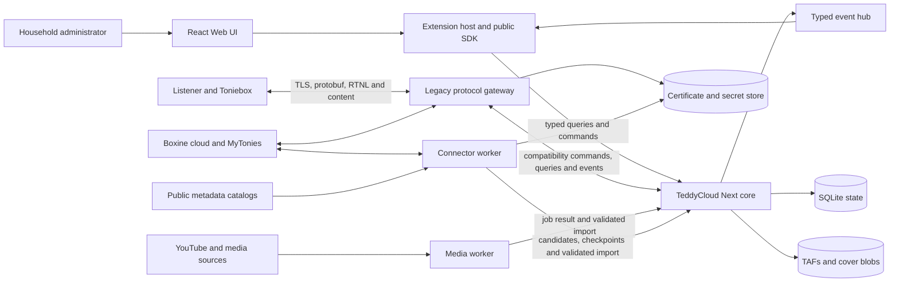

# TeddyCloud Next system context

Status: implementation planning boundary reviewed by PI-01/R and PI-01/B
Source baseline: `cc35138`

## Purpose and evidence boundary

This document defines the components and flows needed to evaluate the
[architecture charter](pi/pi-01-architecture-charter.md). It does not certify a
box generation, select a final deployment topology, or authorize production
migration. Existing routes are evidence from the C source; worker and core APIs
are target contracts to refine in later PIs.

## Context

The target is a modular core with isolated workers. The legacy C gateway remains
the device-facing boundary until contract fixtures and hardware tests justify a
replacement. [ADR-0001](adr/0001-control-plane-and-gateway-sequencing.md) defines
ownership transfer; [ADR-0002](adr/0002-technology-and-repository-topology.md)
selects the process, repository and deployment baseline. These remain planning
decisions until the corresponding implementation and deployment gates pass.

## Actors and trust boundaries

| Boundary | Trusted input | Untrusted or limited input | Required control |
| --- | --- | --- | --- |
| Toniebox to gateway | Provisioned device identity | Network frames, ranges and protobuf payloads | Existing TLS compatibility, bounded parsing, replay fixtures |
| Browser to core | Authenticated administrator commands | Plugin contributions, query values and uploaded files | Authorization, schema validation, size limits and audit records |
| Trusted UI extension | Explicitly installed same-origin module | Module behavior still has application browser privileges | Visible trust decision, versioned SDK and lifecycle cleanup |
| Sandboxed extension | Capability-scoped messages | iframe code and messages | Origin checks, short-lived handles and allow-listed commands |
| Worker to core | Scoped worker identity | Media/catalog payloads and subprocess output | Least privilege, idempotency keys, validation and quotas |
| Core to external services | Explicit connector configuration | Remote metadata, media and outages | Provenance, timeouts, rate limits and no silent overwrite |
| Core to storage | Validated domain command | Paths, interrupted writes and disk failures | Transactions, staged blob writes, digests, backup and rollback |

Certificate material stays in the secret store and is read only by the component
that establishes the relevant external connection. UI extensions never receive
Boxine, MyTonies or device private keys. Workers receive scoped credentials, not
the core database file.

## Data, event and failure flows

| Flow | Producer to consumer | Durable owner | Failure behavior |
| --- | --- | --- | --- |
| Device claim/auth state | Gateway to Tag Registry | Core Tag Registry | Reject incomplete state; preserve prior valid ownership and expose retry status |
| Playback/tag lifecycle | Gateway to event hub to UI/extensions | Event hub cursor plus authoritative Tag Registry state | Reconnect reconciles state; stale responses cannot restore a removed tag |
| Catalog enrichment | Connector/review UI to Catalog Service | Core Catalog Service | Store candidate and provenance; ambiguity cannot auto-assign |
| TAF import | Gateway/media/connector to Content Store | Core Content Store | Publish durable immutable bytes before committing the DB reference; recover unreferenced blobs |
| Tag assignment | UI/extension to Assignment Service | Core Assignment Service | Idempotent command and assignment history; prior assignment remains recoverable |
| Library projection | Core services to Library Query to UI | Underlying domain owners | Stable pagination and sort; filters cannot mutate or hide canonical records permanently |
| Worker job progress | Worker to core/event hub | Worker owns job/checkpoint; core owns imported result | Retry from checkpoint; terminal failure is visible and does not imply successful import |
| Settings/overlays | Administration UI to Settings Service | Core Settings Service | Validate before commit; secret values are redacted from events and diagnostics |

Legacy compatibility needs special handling: `getTagInfoJson()` currently calls
`saveTonieInfo()` in [handler_api.c](../../src/handler_api.c). Therefore a GET to
`/api/getTagInfo` cannot be treated as a side-effect-free shadow read until PI-02
fixtures establish what may change. During migration, each operation has one
active writer; the compatibility facade must not write the new database and the
legacy JSON independently without a reconciled command.

## Scenario J-02: successful Copy

1. The Copy command supplies source `content_version_id`, target rUID and an
   idempotency key to the Assignment Service. A placed-card flow resolves the
   current rUID from authoritative tag state; a registered-card flow chooses it
   explicitly.
2. The service verifies that the target Tag is assignable and that the Content
   Store has a complete, digest-verified TAF. Catalog classification does not
   determine whether the physical card is a Custom Card.
3. One transaction records the new assignment and its predecessor. No plugin or
   worker writes the database or legacy content JSON directly.
4. The same transaction records a durable event and projection outbox entry.
   After commit the Library Query invalidates its view; readback shows the desired
   assignment and its pending/applied status separately.
5. After the core ownership gate, one tested adapter applies the legacy
   representation with a per-tag revision fence and verifies readback. Playback
   assignment is reported as applied only when that revision is confirmed.
   [ADR-0003](adr/0003-persistence-and-projection-recovery.md) defines the order
   and recovery; an unmodified legacy endpoint cannot supply this fence.

If interruption occurs before the authoritative commit, the prior assignment
remains active. If the response is lost after commit, retrying the same key returns
the committed result. If legacy projection fails after the core commit, the new
assignment is marked unreconciled and playback cutover is blocked; unrelated
cards and TAFs remain unchanged.

## Scenario J-07: offline or interrupted connector

1. The Connector Worker records its own job cursor and requests remote metadata
   or an authenticated TAF under source-specific rate limits.
2. Remote metadata enters the Catalog Service as a provenance-bearing candidate.
   It cannot overwrite verified model, Set membership or curated Custom metadata.
3. A TAF download is staged outside the authoritative blob namespace. A network
   failure retains a safe checkpoint or discards only the incomplete staging file.
4. After format and digest validation, the worker calls the Content Store import
   command with an idempotency key. The core durably publishes immutable bytes,
   then commits the version reference and event outbox in one DB transaction.
   These are separate durability steps: failed DB commit can leave a retained
   unreferenced blob; recovery follows ADR-0003.
5. Assignment is a separate command. A successful import never silently remaps a
   card; repeated sync produces the same catalog/content outcome.

While offline, the job remains retryable with a reason and next-attempt policy.
The last verified local TAF and assignment stay usable. Worker restarts resume
from the checkpoint and never infer success from the presence of an NFC file alone.

## Evidence still required

- Sanitized request/response and side-effect fixtures for the legacy API surface.
- A real device/firmware matrix for TB1, TB2, RTNL and cloud-proxy behavior.
- Exact current plugin calls and status/error assumptions from all enhancement
  repositories.
- Failure-injection tests of the ADR-0003 reconciliation/import protocol.
- Implementation proof of secret storage, process isolation and deployment ADRs.
